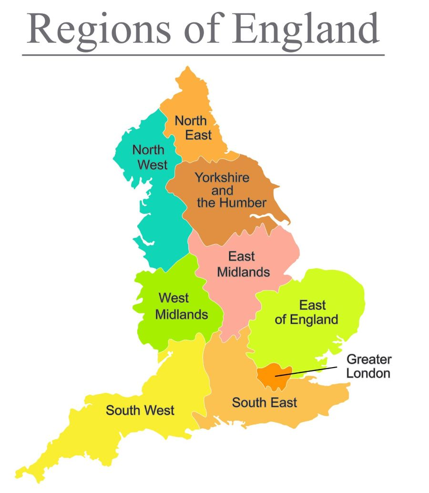
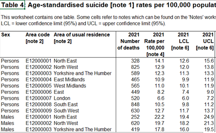

# Data Origins 

The data for this visualisation comes from a National Office of Statistics (ONS) dataset entitled “Suicides in England and Wales”. The dataset consists of data on all of the registered suicides in England and Wales from 1981 to 2021. For this visualisation, I have used only the data from England. The original dataset was categorised by sex, defined by males females and all persons, and by area of usual residence, consisting of the 9 regions of England. The regional boundaries are displayed in the image below: 

```{r, out.width = "400px", echo=FALSE}

```

The dataset I used contained 3 columns which included sex, area code and area of usual residence. The data set also contained a further 4 columns for each year, which included data on the total number of deaths, age-standardised suicide rates of suicide per 100,00, and the upper and lower confidence intervals. The first section of the raw dataset can be seen below: 



# Research Questions

This visualisation attempted to address the fallowing goals:

1. To describe the magnitude of regional and sex differences in suicide rates.

2. To show how these change over time. 

3. To indicate whether there are any possible interactions of region, sex, and time on suicide rates in England. 

  
  

This visualisation also formed part of a research project I am part of for Sunderland University and South Tyneside Council, regarding male suicide in the northeast. For this reason, I also wanted to create a visualisation which could be used in this project. My goal was to create an app which allowed other researchers to examine and compare trends between regions and sexes simultaneously. Mainly, I wanted to be able to use this graph to compare the Northeast, which has one of the highest rates of male suicide, with other regions of England, including the mean rates for England. However, I also wanted to design this visualisation to be able to compare any combination of regions simultaneously. 
For this project, I decided that I would attempt to make an interactive Shiny app so that users could use interactive widgets to generate a visualisation for each region of England. I also wanted this app to have the ability to compare two regions simultaneously. 


# Data Preparation

The data set I obtained from ONS had several problems which I needed to fix before I could use the data for my visualisation. The original data set was an Excel spreadsheet which contained some pages irrelevant to my research question. Furthermore, for the visualisation, I was only interested in obtaining the data on suicide rates per 100,00, sex, area of England and year. I, therefore, had to delete certain sections which were unnecessary. The data was also in wide format and not designed to be used in R. This required me to convert the data into long format and remove some of the formatting which prevented me from generating graphs. 

In order to address these issues, I saved only the relevant page as a .csv file and imported the data. Next, I needed to remove the first few rows as they contained more irrelevant information. I then selected only the variables I was interested in and assigned this to my data frame. After this, I changed the first row of the data to column names. I then change column names to something more appropriate and converted the data frame into long format. After changing the data classes to the appropriate type, I ordered the variables, roughly, from north to south so that they would display in a logical sequence on the axis of one of my graphs. 


```{r message=FALSE}
library(dplyr)
library(janitor)
library(tidyr)
library(tidyverse)
library(shiny)
library(hrbrthemes)
library(plotly)
library(shinythemes)

# reading in data 
raw_data<-read.csv("data/raw_data.csv")

# dropping the first 2 columns of df 

df<- raw_data[-c(1,2),]

# and making the first row the title 

df<- df %>% row_to_names(row_number = 1) 

# selecting only the area, sex and rates per 100k columns 

df<- df %>% 
  select("Sex", contains("Area of usual residence"), contains("per 100,000"))

# and changing the names of the columns

colnames(df)<- gsub("..Rate.per.100.000...note.4.", "", 
                    colnames(df))
colnames(df)[2] = "Area"

# converting the data into tidy (long) format 

df <- df %>%
  pivot_longer(c( '2021','2020', '2019', '2018', '2017', '2016', '2015', '2014', '2013', 
                  '2012', '2011', '2010', '2009','2008', '2007', '2006', '2005', '2004', 
                  '2003', '2002', '2001', '2000', '1999', '1998', '1997', '1996','1995', 
                  '1994', '1993', '1992', '1991', '1990', '1989', '1988', '1987', '1986', 
                  '1985', '1984', '1983', '1982', '1981' ),
               names_to = "year", values_to = "rates_per_100k")


# making  sure the data classes are appropriate 

df$rates_per_100k <- as.numeric(df$rates_per_100k)
df$Area <- as.character(df$Area)
df$Sex <-as.character(df$Sex)


# ordering the area variables from north to south 
# I am going to code this one backwards so it runs from top to bottom 
# north to south when i flip the ggplot using coord_flip()
df$Area <- factor(df$Area, levels = c("South West", "South East", 
                                      "London",
                                      "East", "West Midlands",
                                      "East Midlands", 
                                      "Yorkshire and The Humber", 
                                      "North West",
                                      "North East" ))
```

my cleaned data set now looked like this: 

```{r echo = FALSE}
head(df)
```

# Testing visualisations and updating data frame 

Before beginning with my shiny app I decided that I would make some basic plots using ggplot(). I decided that I would attempt to make a scatterplot a line graph and a bar chart. I wanted to make the scatterplot and line graph to show overall trends between sexes over time. I wanted to use the bar chart to highlight overall regional and sex differences in suicide rates for all time points. 
To do this I decided to make two new data frames. The first comprised the mean rates per 1000k for all years, grouped by area and sex, which I used for the bar chart. The second comprised the mean rates per 100k for all regions, grouped by year and sex, which I used for the scatter plot and line graph. 


```{r}

# creating a mean data frame containing data on the mean for all regions 

mean_data<- df %>% 
  group_by(year, Sex) %>% 
  summarise(rates_per_100k = mean(rates_per_100k))

# and plotting a chart of mean of all areas 

ggplot(mean_data, aes(x = year, y = rates_per_100k, color = Sex)) +
  geom_point()+
  ggtitle(" Mean suicide rates per 100K for all regions of England")+ 
  xlab("Year") + 
  ylab("Mean suicide rates per 100K") 
  

# creating a df for mean data for all years  

mean_data1<- df %>% 
  group_by(Area, Sex) %>% 
  summarise(rates_per_100k = mean(rates_per_100k))


#plotting a histogram of mean suicides in England by sex and Area from all 
#time points

ggplot(mean_data1, aes(x = Area, y = rates_per_100k, fill = Sex)) + 
  geom_col( position = "dodge")+ 
  ggtitle("1981-2021: Mean suicide rates per 100K for males, females 
 and persons by region of England")+ xlab("Region of England") + 
  ylab("Mean suicide rates per 100K")+ 
  coord_flip()

# plotting a line graph of mean suicides in England by sex and Area from all 
#time points

ggplot(mean_data, aes(x = year, y = rates_per_100k, group = Sex)) +
 geom_line()+
  ggtitle(" Mean suicide rates per 100K for all regions of England")+ 
  xlab("Year") + 
  ylab("Mean suicide rates per 100K") 

```

Testing these visualisations gave me a good idea of how I could improve upon their designs. To begin, I noticed that the x-axis on my graphs had overlapping labels. I also felt that adding a trend line to the line graph and scatter plot might aid in interpreting overall trends in the data. Additionally, I felt like the colour scheme could be improved upon in all my graphs. I decided that I would try and address these issues when drawing my graphs in my shiny app. 

After some consideration, I decided that the line graph would address the research question better than the other graphs, so I decided to include only the line graph in my final app. I felt that the line graph did a better job of explaining trends in suicide rates over time. Additionally, I reasoned the use of interactive widgets in my shiny app would complete the objective of comparing different regions. 
However, I felt it was important to visualise the data for the mean suicide rate for all regions alongside that of each individual region. This would allow the user to compare each region to the national average and therefore give them a reference point to make judgements about the data. I decided that I would combine the mean data for all regions data frame with my existing data frame. 


```{r}


# adding mean data for all regions to the df 

# first creating a name for the variables in the mean_data frame 
 
mean_data<- mean_data %>% 
  add_column(Area = "Mean for all regions" )

# now adding mean_data to the main df #

df1<- rbind(df, mean_data )

# making sure the type of data is appropriate 

df1$year <- as.numeric(df1$year)
```


# Creating the shiny app 
## Creating the user interface 

First I chose a theme for my shiny page using the shiny themes package. Then I created an introduction page which contained some brief information on how to use the app. I also included a link to access the original dataset here and a map of the boundaries of England used in my analysis. 

Next, I created a page for my visualisation. 
For my shiny app, I decided that I would try and make two graphs appear on the same page so that users could compare two regions simultaneously. Therefore, I added two separate control widgets to the user interface, one for each graph. I then assigned these to two separate outputs for each of my graphs. 
In the panel labelled visualisation, I added a dropdown box so that users could view a visualisation for a specific region. I also included the mean for all regions variables in the dropdown box. I repeated this process twice, one for each drop-down box widget. I then created the output which I assigned to plotly rather than ggplot. I decided to use plotly as I wanted to display the values for each data point when the user hovered over it. 


```{r}
#creating the interface for multiple tabs and selecting a theme. 
ui<- navbarPage(theme = shinytheme("flatly"),
 title =  "Suicide in England ",
                # adding a tab panel for the description page 
                tabPanel("Description",
                         mainPanel(
                           h1(strong("Suicide Rates in England: Data Visualisation", align = "center")),
                           br(),
                           p("This visualisation uses data from the national office of Statistics 
               on suicides in England from 1981-2021. The original report can be accessed", 
            # inserting link to ONS webpage 
a("here.", href = "https://www.ons.gov.uk/peoplepopulationandcommunity/birthsdeathsandmarriages/deaths/bulletins/suicidesintheunitedkingdom/2021registrations")),
  h2("Purpose of this visualisation "),
p( "The purpose of this visualisation is to examine the trends in suicide rates 
   between sexes and for each region of England from 1981-2021.",
   br(), 
   h3("How to use this app"),
   "This visualisation has been designed so you can compare two specific regions at the same time. To do this simply choose a
   region from the dropdown box and the data for that region will be displayed in the corresponding scatterplot. You can also 
   choose to display the mean suicide rates in England by selecting this from the dropdown menu. If you want to look at the value
   for a specific data point, hover over it with your mouse to view the display."  
, 
   br(), 
   "The boundaries for each region of England can be seen in the map below:"), 
# including an image of map of England 
img(src = "www\\Eng2.jpg", height = 500, width = 400),

p("When you are ready please click the tab entitled  “Visualisation” in the tab panel to continue." )
                         )
                ),   
                
          
  #creating the panel for the Visualisation
                tabPanel("Visualisation",
                         titlePanel(h1("Suicide rates in England.", align = "center")),
                         sidebarLayout(
                           sidebarPanel(
                             helpText("Use the dropdown box to select the region you wish to view."),
                             # adding a dropdown box in the side panel 
                             selectInput("Area", label = ("Choose a region to display in output 1"), 
                                         choices = c ("North East", 
                                                      "North West", "Yorkshire and The Humber",
                                                      "East Midlands",
                                                      "West Midlands", 
                                                      "East",
                                                      "London", 
                                                      "South East", 
                                                      "South West",
                                                      "Mean for all regions"), 
                                         selected = "North East"),
                             
                    # adding a second drop down box in the side panel 
                             selectInput("Area2", label = ("Choose a region To display in output 2"), 
                                         choices = c ("North East", 
                                                      "North West", "Yorkshire and The Humber",
                                                      "East Midlands",
                                                      "West Midlands", 
                                                      "East",
                                                      "London", 
                                                      "South East", 
                                                      "South West", 
                                                      "Mean for all regions"), 
                                         selected = "Mean for all regions"), 
                             
                           ),
                    # creating the output of each widget 
                           mainPanel(
                             plotlyOutput(outputId = "plot", width = "100%"),
                             plotlyOutput(outputId = "plot2", width = "100%")
                           )
                         )  
                )
                
)
```

## Creating the server logic 

Next, I assigned the output of each widget to two corresponding graphs I did this by filtering each data set by the selected area in the drop-down box. 
Using the ggplotly() function I created a ggplot with the capability of displaying values as labels for each data point. Next, I added a trend line to the graph, which a made using dashed lines without the standard error shading around it. In order to get around the problem of overlapping ticks on my x-axis I then changed the frequency of ticks to display every 5 years. I then gave my graph titles based on the interactive widget selection. After this, I changed the colour scheme on my graph to make it look more appealing. I then set limits to the axis on my graphs so that each graph would be easier to compare to another. Then, I removed the toolbar which appears as standard in plotly, as I didn't want my users to get confused with unnecessary information. Finally, I set the hight and width of my graphs, as I didn't want them to expand and contract with screen size changes. 


```{r echo=T, results='hide'}

# Define server logic
# Define server logic
server <- function(input, output) {
  
  # assigning a plot to the output I created in the UI 
  
  output$plot <- renderPlotly({
    
   # telling shiny to select data based on widget input. 
   
    data1 <- filter(df1, Area == input$Area)
    
    # creating ggplot using the ggplotly function for interactive data points. 
    
   ggplotly( ggplot(data1, aes(x = year, y = rates_per_100k, color = Sex, group = Sex,
                               
           # specifying what text i want to appear when users hovers over data points.  
                    
                               text = paste(Area,Sex,"in", year,
                                  "<br>Suicides Per 100k =", 
                          round(rates_per_100k, digits = 1)))) +
      geom_line()+
      geom_point(size = 1.5, color = "black")+
        
      #adding a trend line to the plot
      
      geom_smooth(se = FALSE, linetype="11", size =.8, color = "cornsilk4")+ 
        
      #changing the frequency of dates of the x axis
      
      scale_x_continuous(n.breaks = 10)+
      # adding labels and titles, with interactive code to change the title 
      # with widget use. 
        labs(x="Year", 
             y= "Suicide rates per 100,000", 
             title = paste("Output1:", print(input$Area)))+
      # changing the color scheme to something more appealing.
      
      scale_color_manual(values=c("hotpink", "dodgerblue", "green2"))+
      theme(panel.background = element_rect(fill = 'snow'),
            panel.grid.major = element_line(colour = "cornsilk4"),
            panel.grid.minor = element_line(colour = "grey"),
            plot.background = element_rect(fill = 'cornsilk'))+
     
        # specifying the y axis and axis of the plotly graph. 
        
         ylim(0,25), tooltip = "text")%>% 
    layout(xaxis = list(fixedrange = TRUE)) %>%
    layout(yaxis = list(fixedrange = TRUE)) %>%
     
     #Disabling the plotly toolbar and setting the size of the graph. 
      
    config(displayModeBar = F)%>% 
    layout(height = 400, width = 800)
    
    })
    
    # repeating the same process as above for the second graphs 
    # substituting the first output for the second
    
    output$plot2 <- renderPlotly({
      
   
     data2 <- filter(df1, Area == input$Area2)
      
     ggplotly( ggplot(data2, aes(x = year, y = rates_per_100k, color = Sex, group = Sex,
                                 text = paste(Area,Sex,"in",year,
                                              "<br>Suicides Per 100k =", 
                                              round(rates_per_100k, digits = 1)))) +
        geom_point(size = 1.5, color = "black")+
        geom_line()+
        geom_smooth(se = FALSE, linetype="11", size =.8, color = "cornsilk4")+ 
        scale_x_continuous(n.breaks = 10)+
        labs(x="Year", 
             y= "Suicide rates per 100,000", 
             title = paste("Output2:", print(input$Area2)))+
        scale_color_manual(values=c("hotpink", "dodgerblue", "green2"))+
        theme(panel.background = element_rect(fill = 'snow'),
              panel.grid.major = element_line(colour = "cornsilk4"),
              panel.grid.minor = element_line(colour = "grey"),
              plot.background = element_rect(fill = 'cornsilk'))+
        ylim(0,25), tooltip = "text")%>% 
       layout(xaxis = list(fixedrange = TRUE)) %>%
       layout(yaxis = list(fixedrange = TRUE)) %>%
       config(displayModeBar = F)%>% 
       layout(height = 400, width = 800)
     
  
      
      })
    

  
  
}  


# Run the application 
shinyApp(ui = ui, server = server)

```

# My final application 

It is recommended that you view this application separately
on the webpage though [this link](https://zrte10-andrew-plemper.shinyapps.io/data_visualisation_project/).
However you can also view it in the window below: 

```{r, echo = FALSE,out.width= 1200}

knitr::include_app(
  "https://zrte10-andrew-plemper.shinyapps.io/data_visualisation_project/", height = "1200px")
```


# Summary

Creating this visualisation has greatly improved my R skills. At the beginning of the course, I said I wanted to develop skills in cleaning and managing data mostly. Feel I have achieved this and now I feel confident in importing new messy datasets and using functions for organising and reshaping datasets to be appropriate for analysis or visualisation. Nevertheless, I feel that pushing myself to create a shiny app has also given me a good experience in getting to grips with aspects of R that I was previously unfamiliar with. 
If I had more time, I think I would have liked to create a shiny app where users could use my data to build their own graphs, rather than having to use the ones I created. I feel like this could have allowed the user to explore specific aspects of the dataset they might be interested in, rather than what I had selected. I would have also liked to have found data from other countries within the UK and added this to my data set. In an ideal world, I would have also added some data on variables which may correlate with suicide rates, i.e unemployment, and added these to any graphical representations. 

